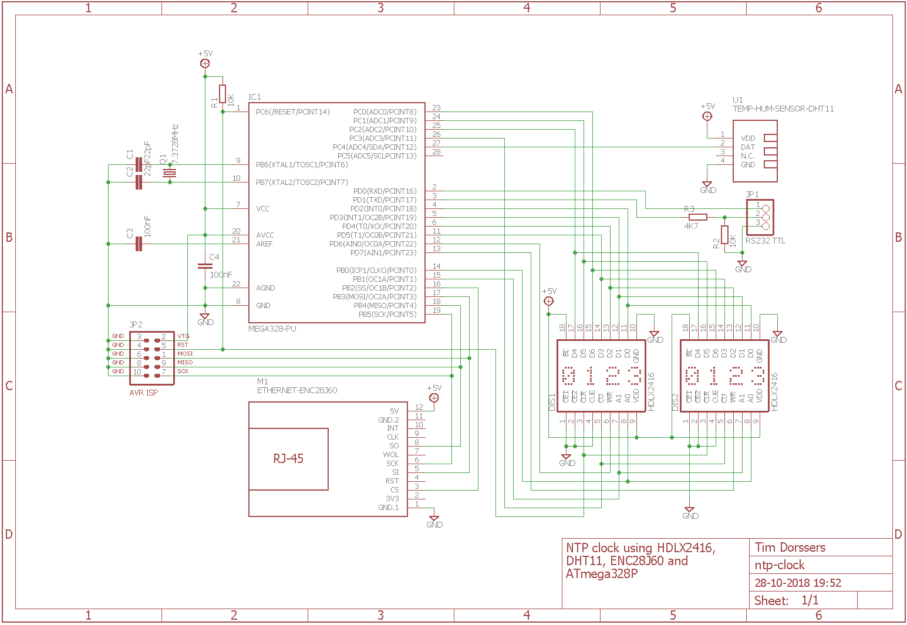
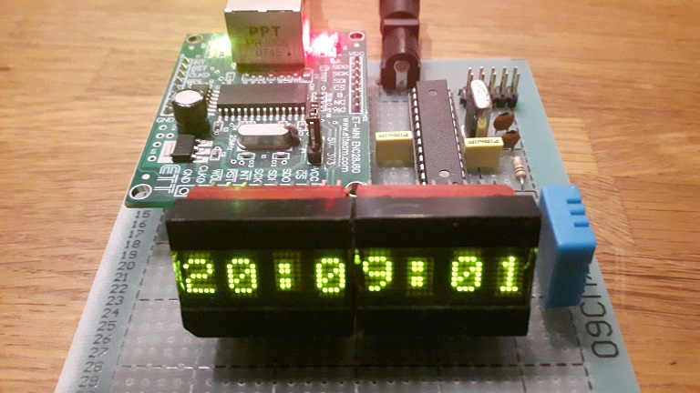

# NTP-clock

This software implements a NTP synchronized clock with two classic HDLX2416 LED matrix displays and a DHT11 temperature and humidity sensor. Dynamic IP address assignment is done using DHCP. DNS lookup is used for NTP host name resolution. It is configurable via a built-in web server that implements GET and POST methods and HTTP basic authentication. Web configurable parameters are stored in EEPROM. At Ethernet link up, an IP address is obtained and displayed for 30 seconds in which ARP, DNS and NTP are executed. If one of those fails, the clock is reinitialized after that time. The modified DHCP client retries obtaining the initial IP at exponential increasing intervals and renews the address lease at half lease time, at 12.5% of the lease time increasing intervals. Standard AVR Libc time keeping functions are used. The highest and lowest temperature and humidity is recorded in RAM with time stamps. Useful log messages are sent to the UART.

It uses a modified version of Guido Socher's TCP/IP stack (http://www.tuxgraphics.org/electronics/200905/embedded-tcp-ip-stack.shtml), with changes to:
- enc28j60.c
- dhcp_client.c
- dnslkup.c
- websrv_help_functions.c

You need to define F_CPU as a symbol to gcc eg. -DF_CPU=7372800
 
## Schematic

## Prototype

## Firmware
The firmware has been developed in Atmel Studio 7 using GCC C and can be uploaded to the ATmega328p using the ISP connector and an ISP programmer such as [USBasp tool](http://www.fischl.de/usbasp/) using [avrdude](http://www.nongnu.org/avrdude/):

`avrdude -p m328p -c usbasp -U flash:w:ntp-clock.hex:i -U efuse:w:0xFC:m -U hfuse:w:0xDF:m -U lfuse:w:0xFF:m`
